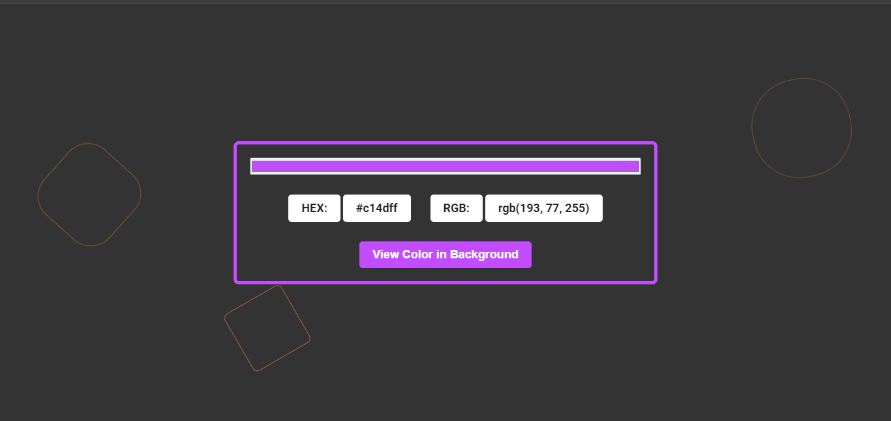
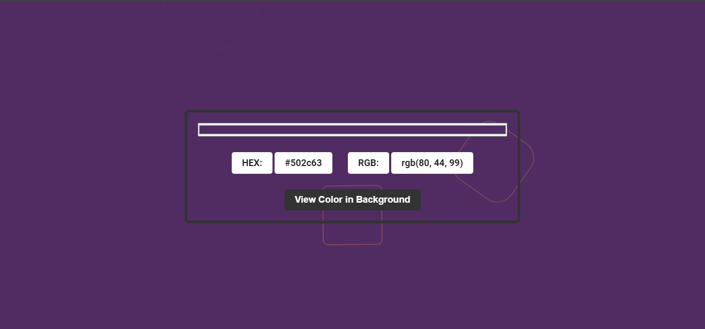
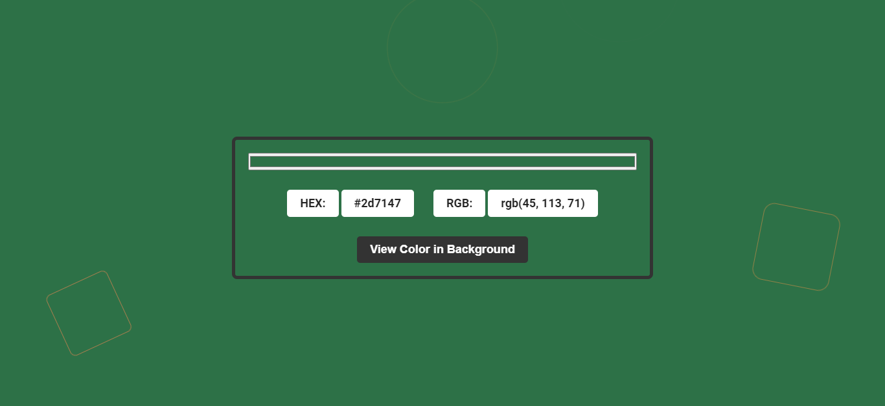

                         
<h1 align="center" style="font-weight: bold;"> Color Picker Website </h1>

<p align="center">🌟Color Picker Website🌟 Discover the perfect hue with our intuitive color picker tool! Easily select and customize colors using a vibrant spectrum or precise sliders.
  View and copy color values in various formats, including HEX, RGB. Ideal for web designers, artists, and anyone seeking the ideal color palette.
</p>

<p align="center">
<a href="#overview">Overview</a>
<a href="#tech">Technologies</a>
<a href="#features">Features</a>
<a href="#demo">Demo</a>
<a href="#started">Getting Started</a>
<a href="#license">License</a> 
<a href="#contribute">Contributing</a> 
<a href="#contact">Contact</a> 
</p>

<p align="center">
<a href="https://murtaza-ax.github.io/Color-Picker/">📱 Visit this Project</a>
</p>

<h2 id="overview">Overview</h2>
<p align="start">**Color Picker** 
  This color picker website offers a user-friendly interface for selecting and customizing colors. With features like a visual spectrum and adjustable sliders, users can easily find 
  their desired hue. The tool also provides the flexibility to view and copy color values in different formats, making it a valuable resource for web designers, artists, and anyone 
  in need of accurate color selection.
</p>
 
<h2 id="tech">💻 Technologies</h2>

- **HTML5**
- **CSS3**
- **Javascipt**


<h2 id="features">✨ Features</h2>

- 🌈 **Visual Color Spectrum**: A vibrant and interactive color wheel for easy selection.
- 📊 **Color Value Display**: Shows color values in various formats (e.g. HEX, RGB).
- 📋 **Clipboard Copying**: Quickly copy the selected color value for immediate use. 
- 🎨 **Modern UI/UX**: A clean and stylish user interface that enhances the user experience.
- 🌐 **Cross-Browser Compatibility**: Works flawlessly across all major browsers.
- 🛠️ **Easily Customizable**: Built with a modular structure, making it simple to modify and expand.
- 🧹 **Clean and Well-Commented Code**: The codebase is organized and easy to understand, making it perfect for developers of all levels.


<h2 id="demo">🖼️ Screenshots</h2>
Here are some screenshots of the **Color Picker** website:





 
<h2 id="started">🚀 Getting started</h2>

<h3>Prerequisites</h3>

To run this project, you'll need:

- A web browser (Chrome, Firefox, Safari, etc.)
- [Git](https://git-scm.com/) for version control (optional)


<h3>Installation</h3>

1. **Clone the repository**:
    ```bash
      git clone https://github.com/Murtaza-Ax/Color-Picker.git
    ```

2. **Open the project** in your favorite code editor:
    ```bash
      cd Color-Picker
    ```

3. **Run the project**:

    Simply open the `index.html` file in your browser to view the page.


<h2 id="license">📄 License</h2>

This project is licensed under the [MIT License](LICENSE).

 
<h2 id="contribute">🤝 Contribution</h2>

We welcome contributions to **Color Picker**! Whether you're fixing bugs, improving documentation, or adding new features, your help is greatly appreciated. 
Here's how to get started:

1. **Fork the Repository**: Click the "Fork" button at the top right of this page to create a copy of the repository under your GitHub account.

2. **Clone the Forked Repository**: Clone your fork to your local machine to start making changes.
     ```bash
       git clone https://github.com/username/Color-Picker.git
     ```
   replace `username` with your actual github name.

3. **Create A New Branch**:  Create a new branch with a descriptive name for your feature or bugfix.

    ```bash
        git checkout -b feature/your-feature-name  
    ```

4. **Make Changes**: Implement your feature or fix the issue. Test your changes thoroughly.

5. **Commit Your Changes**: Write a clear and concise commit message describing your changes.

   ```bash
     git commit -m "your feature name"
   ```
   
6. **Push to the Branch**: Push your changes to your forked repository.
   ```bash
     git push origin feature/your-feature-name
   ```

7. **Create a Pull Request**: Go to the original repository on GitHub and create a pull request. Please provide a detailed explanation of your changes and why they should be merged. 
   
⭐ Thank you for considering contributing!

<h3>Documentations that might help</h3>

[📝 How to create a Pull Request](https://www.atlassian.com/br/git/tutorials/making-a-pull-request)

[💾 Commit pattern](https://gist.github.com/joshbuchea/6f47e86d2510bce28f8e7f42ae84c716)


<h2 id="Contact">📧 Contact</h2>

If you have any questions or suggestions, feel free to reach out:

- **GitHub**: [Murtaza-Ax](https://github.com/Murtaza-Ax)
- **Email**: [Murtaza ALi](mailto:murtaza.official264@example.com)

⭐ If you like this project, consider giving it a star on GitHub! Your support is much appreciated.

Made with ❤️ by Murtaza Ali
